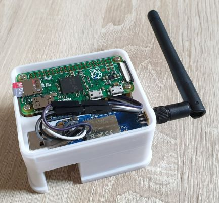

# Case for Raspberry Pi Zero and Zigbee USB Stick

Simple 3D-printable Case for a Raspberry Pi Zero and a Zigbee USB Stick.

To integrate a [TRÅDFRI Shortcut Button](https://www.ikea.com/de/de/p/tradfri-shortcut-button-weiss-40356381/) into my
home automation system. I wanted to use a [Raspberry Pi Zero](https://www.raspberrypi.org/products/raspberry-pi-zero/)
with a [Zigbee USB stick](https://www.ebay.de/itm/224580249807). The power supply and the integration into the network
should be done using PoE. For this a
[PoE Ethernet HAT from Waveshare](https://www.waveshare.com/product/raspberry-pi/hats/interface-power/poe-eth-usb-hub-hat.htm)
is used, which offers both functions. For the individual components I needed a small case in which everything can be
compactly installed. This small project was the result.

The components were designed using [OpenSCAD](https://openscad.org/). The files are placed in the scad folder. Furthermore,
the finished 3D models are placed in the stl folder.

## Components

### Main case

The main case houses the Raspberry Pi Zero with the PoE Ethernet HAT and the Zigbee USB stick. To use as little space as
possible, the USB stick is mounted parallel to the Raspberry Pi Zero (see above). This makes it necessary to solder the
USB connection. However, this makes the case much more compact.

### Cover

The cover is kept simple. Besides a few ventilation slots, it has two openings on the side that allow the cover to be
easily removed with a screwdriver.

### Wall mount

With the wall mount, the entire housing can be easily attached to the wall. It can be slid into the mount from above.
There are small rails on the actual housing for this purpose. A cutout for the network cable is also included.

### Spacer ring

The last component is a small spacer ring, which is installed between the antenna and the housing. This fixes the
USB stick firmly to the housing.

## Links

* [Raspberry Pi Zero - mechanical drawing](https://datasheets.raspberrypi.org/rpizero/raspberry-pi-zero-mechanical-drawing.pdf)
* [Waveshare PoE Ethernet / USB HUB HAT](https://www.waveshare.com/product/raspberry-pi/hats/interface-power/poe-eth-usb-hub-hat.htm)
* [Zigbee CC2652P2 Coordinator v4 Stick](https://www.ebay.de/itm/224580249807)
